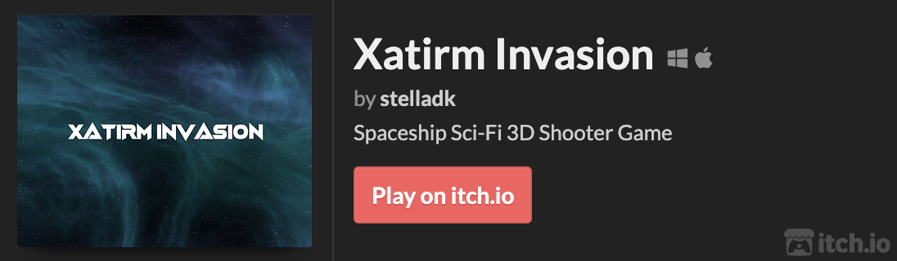
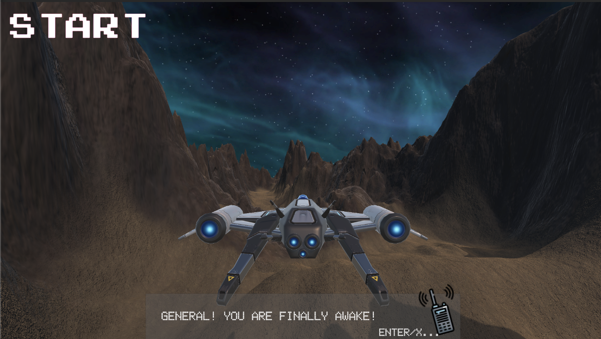
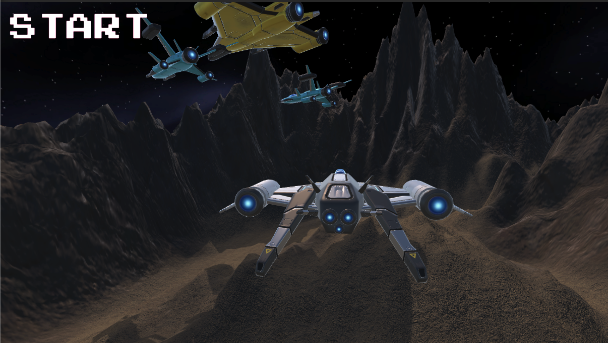
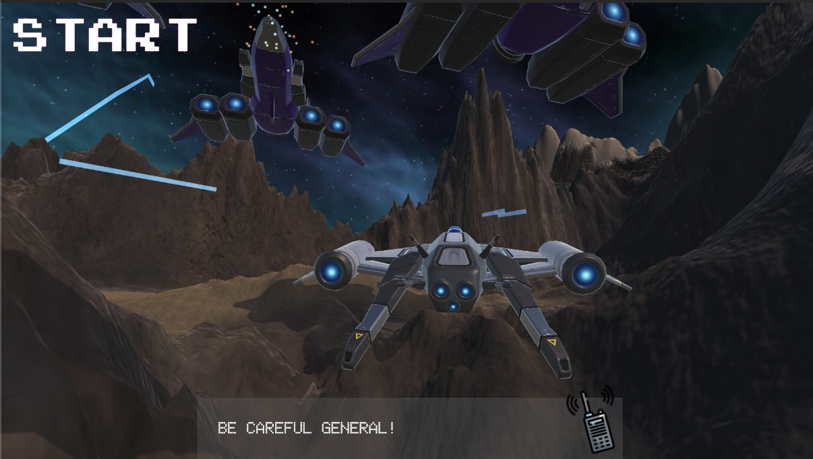

# Xatirm Invasion 
### Spaceship Sci-Fi 3D Shooter Game
From 
['Complete C# Unity Game Developer 3D'](https://www.udemy.com/share/101Wey3@occDr7pKXv2cfZCobbnh2lkze5Pmjp_IYD8EG3oD64DJT-iMI25hix9VCl3EPx0T/) : Section 4

## Gameplay

## Features
- Terrain Build
- Animations with Master Timeline
- Input System & Movement Control
- Particle System
- Collisions & Triggers
- User Interface
- Enemy Hit Points
- Enemy Waves
- Dialogue
- Singleton Music Player & SFX
- Skybox & Lighting
- Post Processing
